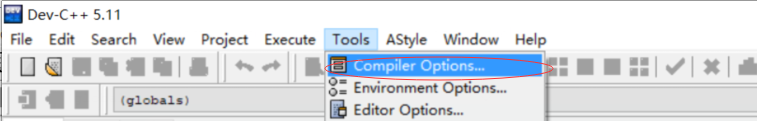
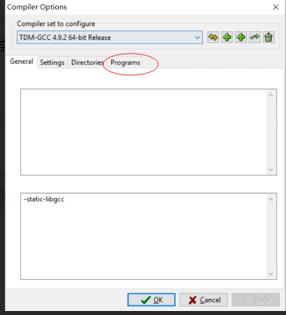
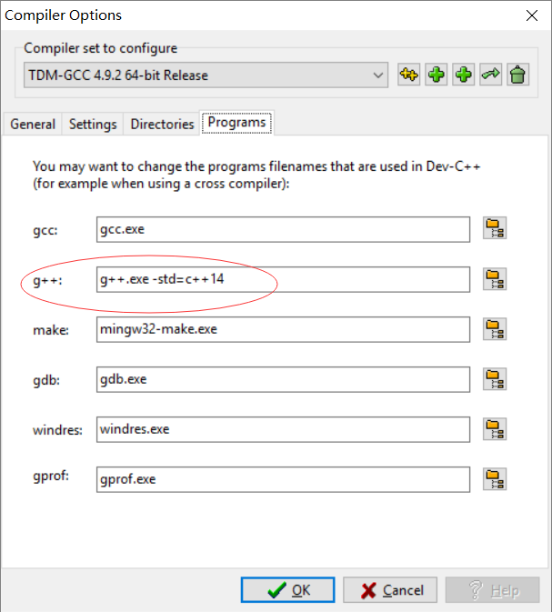

# 矩阵库
这是一个使用了C++标准库写出来的矩阵相关操作的库，能够完成矩阵求逆、转置、基本的算数运算。并且重载了大部分操作符，所以使用起来比较方便。

缺点是在矩阵乘法使用的是原生的算法，还没有优化，时间复杂度应该是O(n^3)。

主要的头文件在**matrix**目录下。

## v1.3注意

v1.3为了完成部分功能，使用了C++17的特性。具体有：
1. if constexpr，在文件[mat_type.h]("./src/mat_type.h")的函数Mat<T>::Random中使用了这个特性。
2. 在实现矩阵链式乘法的优化版本中，使用了`std::variant`来实现解析乘法优先级。

如果不支持C++14，可以选择Branch中的tag，找到指定的版本，返回v1.2.

v1.2需要C++14

## 已完成的功能

>v1.3

|算数运算|
|---|
|[1. 基本类型](#1.)|
|[2. 加法](#2.)|
|[3. 减法、除法、(与常数的)乘法同样](#3.)|
|[4. 矩阵乘法](#4.)|
|[5. 转置和求逆](#5.)|
|[6. 随机数矩阵](#6.)|
|[7. 滤波章节例子3.1](#7.)|
|[8. 动态规划优化后的链式乘法](#8.)|

## 使用方法和配置

在使用的cpp文件目录下， 拷贝matrix.hpp文件，或者自己创建复制其中内容都行。在使用的cpp文件同一级目录下```#include "matrix.hpp"```就可以了。

需要c++14。一般最新的dev-cpp都能够支持到c++14，17就不一定了。配置如图：

1. 打开工具->编译选项


2. 点击这个位子，program  


3. 在g++后面添加```-std=c++14```，注意与前面的g++.exe有个空格  


<h3 id="1.">1. 基本类型</h3>

矩阵的基础类型为```wj::Mat<T>```, ```T```为```double, float, int```，分别对于类型```Matd, Matf, Mati```。

```C++
using Matd = wj::Mat<double>;
using Matf = wj::Mat<float>;
using Mati = wj::Mat<int>;
```

#### 1.1构造函数和访问

```C++
// 一个3x3的矩阵
wj::Mati a{
           {1, 2, 3},
           {4, 5, 6},
           {7, 8, 9}};
// 一个3x4的矩阵，默认为元素全为0的矩阵
wj::Mat<int> b(3, 4);

// 构造之后可以通过以下两种方法访问/修改矩阵的每一个数
printf("我是a[0][0]:%i\n 我是a(1, 1):%i\n", matrix_3by3[0][0], matrix_3by3(1, 1));
/*
我是a[0][0]:1
我是a(1, 1):5
*/
a(1, 1) = 3;
a[1][1] = 3; // 同上
```

如果不想在每一个对象/函数前用```wj::```，可以在```#include "matrix/matrix.h"```之后使用```using namespace wj;```。（以下例子默认使用using...）

#### 1.2 单位矩阵

```C++
// c 是一个3x3的单位矩阵
Matd c = Matd::Eye(3);
```

#### 1.3 使用流进行(cout)输出

```C++
cout << a;
/* 输出：
matrix:
value_type: d
size:       3 x 3
[[1, 2, 3]
 [4, 5, 6]
 [7, 8, 9]]
 */
```

#### 1.4 Clone()

```C++
Matd cl = a.Clone()
```

#### 1.5 行列大小

```C++
std::size_t row = a.RowSize();
std::size_t col = a.ColSize();
```

<h3 id="2.">2. 加法</h3>

如果矩阵之间的操作，行列不匹配则会抛出异常(invalid_argument)。

#### 2.1 矩阵之间加法

```C++
Matd d = a + a;
/*
matrix:
value_type: d
size:       3 x 3
[[2, 4, 6]
 [8, 10, 12]
 [14, 16, 18]]
 */
```

#### 2.2 矩阵和常数的加减法

```C++
Matd e = 2 + a;
// e = a + 2; 相同的结果
/*
matrix:
value_type: d
size:       3 x 3
[[3, 4, 5]
 [6, 7, 8]
 [9, 10, 11]]
 */
```

<h3 id="3.">3. 减法、除法、(与常数的)乘法同样</h3>

<h3 id="4.">4. 矩阵乘法</h3>

#### 4.1 矩阵乘法

```C++
Matd f = c * a;
/*
matrix:
value_type: d
size:       3 x 3
[[1, 2, 3]
 [4, 5, 6]
 [7, 8, 9]]
 */
```

#### 4.2 点乘

```C++
// a点乘d
Matd g = a.DotProduct(d);
/*
matrix:
value_type: d
size:       3 x 3
[[2, 8, 18]
 [32, 50, 72]
 [98, 128, 162]]
 */
```

<h3 id="5.">5. 转置和求逆</h3>

转置和求逆，以及各种操作都是产生新的矩阵(Mat对象)。

```C++
Matd m{
       {1, 2, 0},
       {3, 4, 4},
       {5, 6, 3}};

cout << m.Transpose();
/*
matrix:
value_type: d
size:       3 x 3
[[1, 3, 5]
 [2, 4, 6]
 [0, 4, 3]]
*/

cout << m.Inverse();
/*
matrix:
value_type: d
size:       3 x 3
[[-1.2, -0.6, 0.8]
 [1.1, 0.3, -0.4]
 [-0.2, 0.4, -0.2]]
 */
 ```

 <h3 id="6.">6. 随机数矩阵</h3>

随机数矩阵使用```Mat<T>```的静态函数```Mat<T>::Random(low, high, row, col)```来生成。是随机数均匀分布，生成的类型是```T```。

例子：</br>
```C++
Matd m = wj::Matd::Random(-100., 100., 5, 5);
cout << m;
/*
matrix:
value_type: d
size:       5 x 5
[[-73.6924, -8.26997, -56.2082, 35.7729, 86.9386]
 [3.88327, -93.0856, 5.94004, -98.4604, -86.6316]
 [37.3545, 86.0873, 5.38576, 30.7838, 40.2381]
 [52.4396, -90.5071, -34.3532, 51.2821, -26.9323]
 [96.5101, 50.6712, -85.4628, 76.9414, -12.7177]]
 */

Mati mm = wj::Mat<int>::Random(-100., 100., 5, 5);
cout << mm;
/*
matrix:
value_type: i
size:       5 x 5
[[-100, -74, 51, -8, 7]
 [-56, -91, 36, 36, 87]
 [-23, 4, 67, -94, -90]
 [6, 34, -99, -23, -87]
 [-17, 38, 18, 87, 70]]
 */
```

<h3 id="7.">7. 滤波章节例子3.1</h3>

```C++
Matd L = {{1, 1}};
L = L.Transpose();
Matd mu_Y{{0}, 
            {0}};
Matd D_Y{{2, 0}, 
            {0, 2}};
Matd D_delta{{2, 0}, 
                {0, 2}};
Matd D_Y_delta{{0, -1}, 
                {0, 0}};
Matd B{{-1, -1},
        {-1, 0}};
// D_YY * B.Transpose() + D_Y_delta
Matd tmp1 = D_Y * B.Transpose() + D_Y_delta;
Matd tmp2 = D_delta + B * D_Y_delta + D_Y_delta.Transpose() * B.Transpose() + B * D_Y * B.Transpose();
Matd tmp3 = tmp2.Inverse();
Matd Y_hat = mu_Y + tmp1 * tmp3 * (L - B * mu_Y);
cout << "tmp3(inverse):\n" << tmp3;
cout << "Y_hat :\n" << Y_hat;
/*
tmp3(inverse):
matrix:
value_type: d
size:       2 x 2
[[0.222222, -0.111111]
 [-0.111111, 0.222222]]
Y_hat :
matrix:
value_type: d
size:       2 x 1
[[-0.555556]
 [-0.222222]]
*/
```

## 自己的一些疑问

19-2-27

完成部分重构，添加了
1. operator()(size_t rowIndex, colIndex)
2. 完成binary_operation对宏替换为函数

19-3-20

**需要支持C++17**


<h3 id="8.">8. 动态规划优化后的链式乘法</h3>
1. 更新动态规划对矩阵乘法优化。方法为```OptimizedChainMultiply(Args&&... args)```。输入参数给他，就可以完成由动态规划优化的矩阵链式乘法。

```C++
        void TestOptimizedChainMultiply() {
        
        std::clock_t time_point_1;
        std::clock_t time_point_2;
        std::clock_t time_point_3;
        using wj::Mati;
        Mati a0 = Mati::Random(0, 10, 100, 500);
        Mati a1 = Mati::Random(0, 10, 500, 10);
        Mati a2 = Mati::Random(0, 10, 10, 75);
        Mati a3 = Mati::Random(0, 10, 75, 55);
        Mati a4 = Mati::Random(0, 10, 55, 10);
        Mati a5 = Mati::Random(0, 10, 10, 100);
        Mati a6 = Mati::Random(0, 10, 100, 74);
        Mati a7 = Mati::Random(0, 10, 74, 45);
        Mati a8 = Mati::Random(0, 10, 45, 200);
        Mati a9 = Mati::Random(0, 10, 200, 100);
        Mati a10 = Mati::Random(0, 10, 100, 200);
        Mati a11 = Mati::Random(0, 10, 200, 700);
        
        time_point_1 = std::clock();
        auto result = a0 * a1 * a2 * a3 * a4 *
                a5 * a6 * a7 * a8 * a9 * a10 * a11;
        time_point_2 = std::clock();
        auto ret = wj::OptimizedChainMultiply(
                a0, a1, a2, a3, a4, a5, a6, a7, a8, a9, a10, a11
        );
        time_point_3 = std::clock();
        // 对两个矩阵进行比较
        std::cout << std::boolalpha << (result == ret) << "\n";

        double dur1 = static_cast<double>(time_point_2 - time_point_1) * 1000.;
        double dur2 = static_cast<double>(time_point_3 - time_point_2) * 1000.;
        std::fprintf(stdout, "Native use time:%f(ms)\n",(dur1 / CLOCKS_PER_SEC));
        std::fprintf(stdout, "Optimezed use time:%f(ms)\n",(dur2 / CLOCKS_PER_SEC));
        }

        /**
         * 在单元测试中输出的结果：
        TestOptimizedChainMultiply
        15:27:47
        144 ./TEST/unit_test.cpp
        true
        Native use time:687.500000(ms)
        Optimezed use time:93.750000(ms)
        */
```

2. 更新对Random的使用，使用了`if constexpr`来使得随机生成器合法，需要C++17.

3. 添加了==运算符的重载，能够比较两个相同类型的Mat。不同类型是不能够比较的。